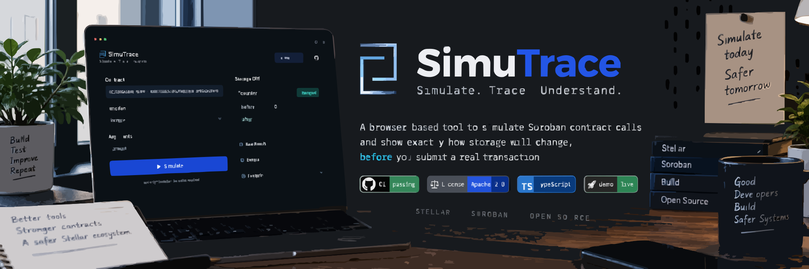

# SimuTrace

[](https://github.com/Hollujay/simutrace/actions/workflows/ci.yml) [](LICENSE) [](https://www.typescriptlang.org/) [](https://simutrace.vercel.app) [](https://hollujay.github.io/simutrace/)

**Live:** [simutrace.vercel.app](https://simutrace.vercel.app) · **Docs:** [hollujay.github.io/simutrace](https://hollujay.github.io/simutrace/)

A browser-based tool that shows exactly how a Soroban smart contract call will change storage, before you submit a real transaction.

## What this is (and isn't)

SimuTrace exists for one job: take a specific function call on a Soroban contract, simulate it, and show a clear before/after diff of the storage keys that call actually touches.

It does **not**:

- Provide a general contract browser or spec viewer (see Stellar Lab's Contract Explorer for that)
- Submit real transactions or request wallet signatures. All calls are read-only simulations.
- Support Stellar Asset Contracts (SACs) yet. SACs have no deployed WASM, so the current spec-fetching approach doesn't work for them. Custom Soroban contracts are supported.

## Quick start

Requires Node 22+.

```bash
git clone https://github.com/Hollujay/simutrace.git
cd simutrace
npm install
npm run dev
```

Open the local URL, paste a deployed custom Soroban contract address on testnet, pick a function, fill in its arguments, and simulate. If the call writes to storage, you'll see each affected key with its value before and after.

Or skip the setup and use the live version at [simutrace.vercel.app](https://simutrace.vercel.app).

## CLI

SimuTrace also ships a command-line entry point that runs the exact same simulation and diff logic as the browser app, useful for scripting or CI assertions.

```bash
npm run cli -- check --contract <id> --function <name> --network <testnet|mainnet> --args <key=value,...> [--json]
```

- `--contract` is the contract address to call.
- `--function` is the function to simulate.
- `--network` is `testnet` or `mainnet`. Testnet uses SimuTrace's built-in RPC endpoint. Mainnet has no default endpoint (there is no single official public one), so you must also pass `--rpc-url <url>` pointing at your own provider.
- `--args` is a comma-separated list of `name=value` pairs, matching the function's parameter names. Values are parsed the same way the web app's call builder parses them (numbers, `true`/`false`, `G...`/`C...` addresses, and so on).
- `--json` switches the output from human-readable text to the machine-readable schema documented below.

Full flag reference and JSON schema also live on the [docs site](https://hollujay.github.io/simutrace/reference).

Example (real output, against a deployed testnet contract):

```
$ npm run cli -- check --contract CACI5YOIX2R23F6LZTGUA6ADLZQY6BEVBLIXPDQBMGJ2W6QXIJSKDHHV --function increment --network testnet
Contract: CACI5YOIX2R23F6LZTGUA6ADLZQY6BEVBLIXPDQBMGJ2W6QXIJSKDHHV
Function: increment
Network: testnet
Cost: 18332
Return value: 1
Ledger: 4692217

Storage diff (1 changed of 1 total):
  [added] "COUNTER"
    after: 1
```

### Exit codes

- `0`: the simulation ran successfully. This is returned regardless of whether the diff is empty or non-empty, an empty diff from a genuine simulation is a valid result.
- `1`: the simulation did not genuinely complete. This covers an unreachable RPC endpoint, an invalid contract or function, a simulation error reported by the RPC, invalid arguments, and invalid CLI usage. SimuTrace never prints an empty or misleading diff in place of a real failure; a non-zero exit always means the command has something specific to report.

### JSON output schema

`--json` prints one JSON object to stdout. On success:

```jsonc
{
  "ok": true,
  "contract": "CACI5YOIX2R23F6LZTGUA6ADLZQY6BEVBLIXPDQBMGJ2W6QXIJSKDHHV",
  "function": "increment",
  "network": "testnet",
  "restoreRequired": false,
  "returnValue": 1,
  "minResourceFee": "18332",
  "latestLedger": 4692217,
  "diff": [
    { "key": "\"COUNTER\"", "status": "added", "before": null, "after": 1 }
  ]
}
```

- `restoreRequired` is `true` when the contract data has expired and needs to be restored before it can be simulated; `diff` is empty in that case because no simulation of the actual call could run yet, not because nothing changed.
- Each `diff` entry's `status` is one of `"added"`, `"changed"`, `"removed"`, `"unchanged"`.

On failure:

```jsonc
{
  "ok": false,
  "contract": "CBAD00000000000000000000000000000000000000000000000000000",
  "function": "foo",
  "network": "testnet",
  "error": {
    "kind": "malformed-spec",
    "message": "Failed to parse contract spec: Invalid contract ID: CBAD00000000000000000000000000000000000000000000000000000",
    "details": {
      "contractId": "CBAD00000000000000000000000000000000000000000000000000000",
      "reason": "Invalid contract ID: CBAD00000000000000000000000000000000000000000000000000000"
    }
  }
}
```

- A failure object never has a `diff` field. `error.kind` matches one of the error kinds the web app also reports (`contract-not-found`, `sac-not-supported`, `no-embedded-spec`, `malformed-spec`, `simulation-failed`, `rpc-unreachable`, `rpc-error`, `invalid-argument`). `error.details` carries the rest of that error's fields for scripting.

## Architecture

```
ContractInput -> contractSpec.ts -> FunctionList -> CallBuilder
                                                        |
                                                        v
                                              simulateCall (simulateCall.ts)
                                                        |
                                          +-------------+-------------+
                                          v                           v
                                  storageSnapshot.ts            SimulationResult
                                  (before, via footprint)
                                          |
                                          v
                                    diff.ts -> StorageDiff
```

The simulation's footprint tells us which storage keys a call would touch. We read those keys' current values before simulating, then diff them against the values the simulation returns. This is why only the keys a specific call touches can be diffed, not a contract's full storage.

See the [Architecture](https://hollujay.github.io/simutrace/architecture) and [Threat Model](https://hollujay.github.io/simutrace/threat-model) pages on the docs site for more detail.

## Contributing

See CONTRIBUTING.md for setup and code style. Security issues should be reported privately, see SECURITY.md.

## Community

Questions or discussion: reach out on Telegram, [@Hollujay21](https://t.me/Hollujay21).

## Maintainers

| Name | GitHub | Telegram |
|---|---|---|
| Hollujay | [@Hollujay](https://github.com/Hollujay) | [@Hollujay21](https://t.me/Hollujay21) |

## Contributors

<a href="https://github.com/Hollujay/simutrace/graphs/contributors">
  
</a>
