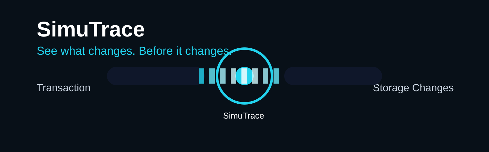

# SimuTrace

[](https://github.com/Hollujay/simutrace/actions/workflows/ci.yml)

[](LICENSE)

**Live:** [simutrace.vercel.app](https://simutrace.vercel.app)

A browser-based tool that shows exactly how a Soroban smart contract call will change storage, before you submit a real transaction.

## What this is (and isn't)

SimuTrace exists for one job: take a specific function call on a Soroban contract, simulate it, and show a clear before/after diff of the storage keys that call actually touches.

It does **not**:

- Provide a general contract browser or spec viewer (see Stellar Lab's Contract Explorer for that)
- Submit real transactions or request wallet signatures. All calls are read-only simulations.
- Support Stellar Asset Contracts (SACs) yet. SACs have no deployed WASM, so the current spec-fetching approach doesn't work for them. Custom Soroban contracts are supported.

## Quick start

Requires Node 22+.

```bash
git clone https://github.com/Hollujay/simutrace.git
cd simutrace
npm install
npm run dev
```

Open the local URL, paste a deployed custom Soroban contract address on testnet, pick a function, fill in its arguments, and simulate. If the call writes to storage, you'll see each affected key with its value before and after.

Not yet deployed anywhere public; run it locally for now.

## CLI

SimuTrace also ships a command-line entry point that runs the exact same simulation and diff logic as the browser app, useful for scripting or CI assertions.

```bash
npm run cli -- check --contract <id> --function <name> --network <testnet|mainnet> --args <key=value,...> [--json]
```

- `--contract` is the contract address to call.
- `--function` is the function to simulate.
- `--network` is `testnet` or `mainnet`. Testnet uses SimuTrace's built-in RPC endpoint. Mainnet has no default endpoint (there is no single official public one), so you must also pass `--rpc-url <url>` pointing at your own provider.
- `--args` is a comma-separated list of `name=value` pairs, matching the function's parameter names. Values are parsed the same way the web app's call builder parses them (numbers, `true`/`false`, `G...`/`C...` addresses, and so on).
- `--json` switches the output from human-readable text to the machine-readable schema documented below.

Example (illustrative output, shaped like the fixture the test suite uses):

```
$ npm run cli -- check --contract CCJZ5DGASBWQXR5MPFCJXMBI333XE5U3FSJTNQU7RIKE3P5GN2K2WYD5 --function increment --network testnet --args amount=5
Contract: CCJZ5DGASBWQXR5MPFCJXMBI333XE5U3FSJTNQU7RIKE3P5GN2K2WYD5
Function: increment
Network: testnet
Cost: 100
Return value: 5
Ledger: 12345

Storage diff (1 changed of 1 total):
  [changed] "counter"
    before: 0
    after: 5
```

### Exit codes

- `0`: the simulation ran successfully. This is returned regardless of whether the diff is empty or non-empty, an empty diff from a genuine simulation is a valid result.
- `1`: the simulation did not genuinely complete. This covers an unreachable RPC endpoint, an invalid contract or function, a simulation error reported by the RPC, invalid arguments, and invalid CLI usage. SimuTrace never prints an empty or misleading diff in place of a real failure; a non-zero exit always means the command has something specific to report.

## Architecture

```
ContractInput -> contractSpec.ts -> FunctionList -> CallBuilder
                                                        |
                                                        v
                                              simulateCall (simulateCall.ts)
                                                        |
                                          +-------------+-------------+
                                          v                           v
                                  storageSnapshot.ts            SimulationResult
                                  (before, via footprint)
                                          |
                                          v
                                    diff.ts -> StorageDiff
```

The simulation's footprint tells us which storage keys a call would touch. We read those keys' current values before simulating, then diff them against the values the simulation returns. This is why only the keys a specific call touches can be diffed, not a contract's full storage.

## Contributing

See CONTRIBUTING.md for setup and code style. Security issues should be reported privately, see SECURITY.md.

## Maintainers

| Name | GitHub |
|---|---|
| Hollujay | [@Hollujay](https://github.com/Hollujay) |

## Contributors

<a href="https://github.com/Hollujay/simutrace/graphs/contributors">
  
</a>
